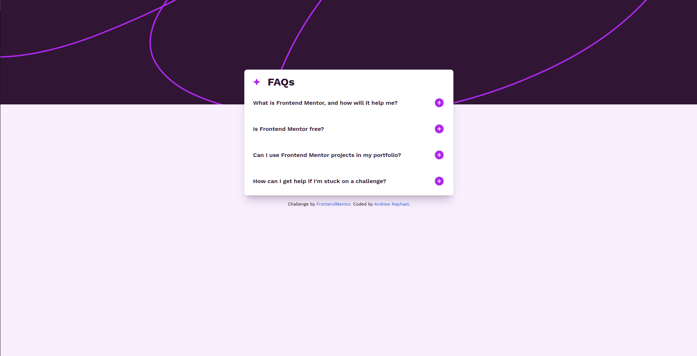

<h1 align="center"> FAQ accordion </h1>

  <a href="#-tecnologias">Tecnologias</a>&nbsp;&nbsp;&nbsp;|&nbsp;&nbsp;&nbsp;
  <a href="#-projeto">Projeto</a>&nbsp;&nbsp;&nbsp;|&nbsp;&nbsp;&nbsp;

 

  

## 🚀 Tecnologias

Esse projeto foi desenvolvido com as seguintes tecnologias:

- HTML e TailwindCSS
- Javascript
- Git e Github

## 💻 Projeto

O FAQ Accordion é um componente interativo que organiza perguntas frequentes em uma interface compacta e acessível. Com um design responsivo, o componente permite que os usuários expandam ou colapsem cada pergunta para visualizar as respostas, economizando espaço e melhorando a usabilidade.

 

    Challenge by <a href="https://www.frontendmentor.io?ref=challenge" target="_blank">Frontend Mentor</a>. 
    Coded by <a href="#">Andrew Raphael</a>.
  

